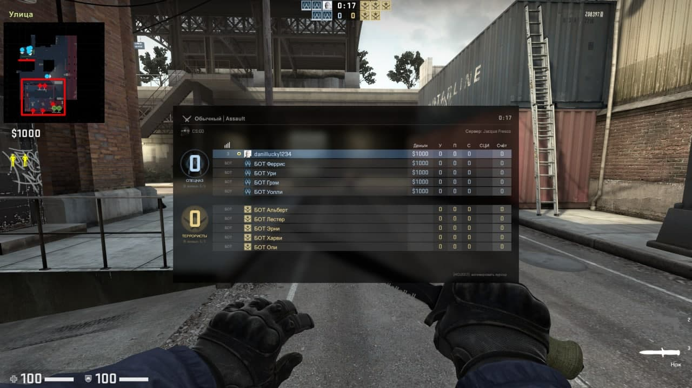
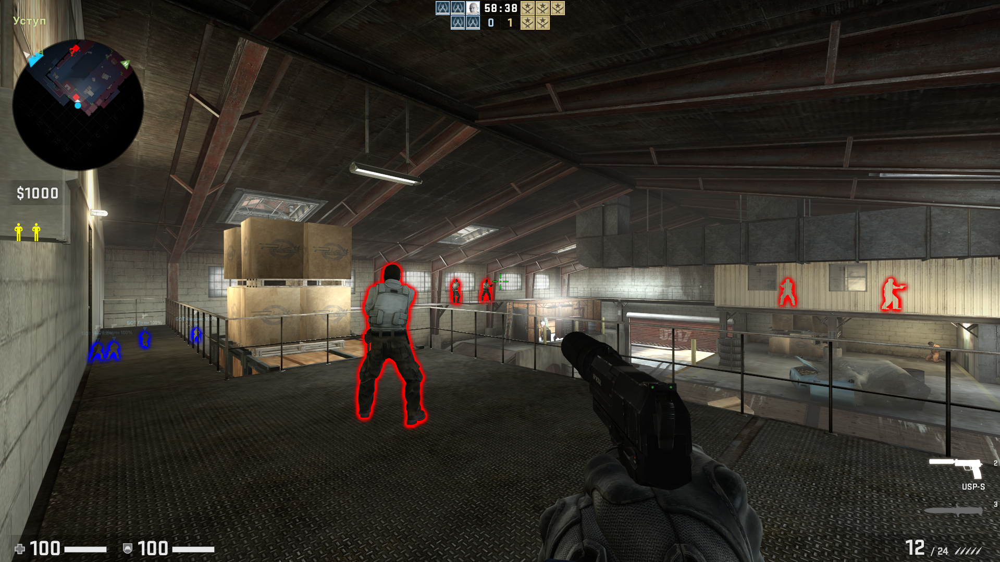
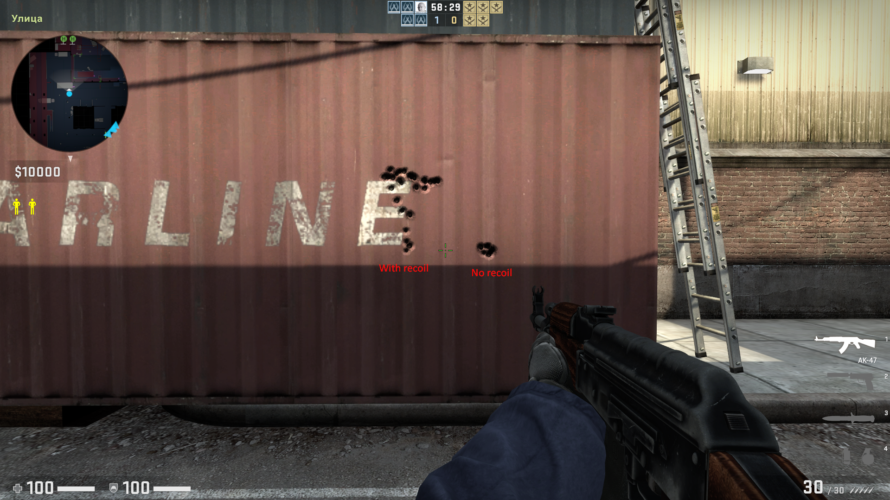

# Simple-csgo-cheat
Extremely simple external cheat for cs go. You can use it to learn something new

# How to use
1. You need to go to https://github.com/frk1/hazedumper/blob/master/csgo.cs and check the availability of updated offsets. If there are new offsets, be sure to replace their values in the Offsets.cpp file.
2. Open the project in Visual Studio, set the Release configuration | x86 and build the solution.
3. Open cs:go
4. In Explorer, find a file with the extension .exe and run it. Or you can compile the solution directly into Visual Studio
5. Enjoy it!

## Hot keys
F5  -  Radarhack
F6  -  Wallhack
F7  -  Bunnyhop
F8  -  No flash
F9  -  No recoil

## Some information

  - Radarhack:
<dl>
  <dt>Functions:</dt> 
  <dd>Radarhack displays all enemies on the radar, which means that by looking periodically at the radar, you will know the location of the enemies</dd>
</dl>

 - Wallhack:
<dl>
  <dt>Functions:</dt> 
  <dd>Wallhack shows all opponents, even those behind the walls</dd>
</dl>

 - Bunnyhop
<dl>
  <dt>Functions:</dt> 
  <dd>Bunnyhop helps you move quickly on the map. You can jump out of the wall unexpectedly and kill your opponent</dd>
</dl>
 - No flash
<dl>
  <dt>Functions:</dt> 
  <dd>With this feature flash grenades will no longer blind you</dd>
</dl>
 - No recoil
<dl>
  <dt>Functions:</dt> 
  <dd>Without kickback, all bullets fly to one point, which may help when firing some weapons</dd>
</dl>

